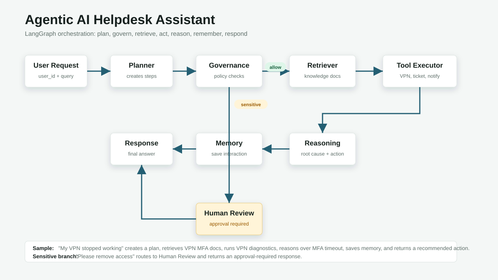

# Agentic AI Helpdesk Assistant

Production-oriented Python scaffold for an enterprise helpdesk agent using FastAPI, LangGraph, Gemini/OpenAI-compatible LLM interfaces, PostgreSQL, Redis, and pgvector.

## Architecture



```text
User Request
  -> Planner
  -> Governance Check
  -> Knowledge Retrieval
  -> Tool Execution
  -> Reasoning
  -> Memory Update
  -> Response
  -> END

Sensitive operation:
User Request -> Planner -> Governance Check -> Human Review -> Response -> END
```

The implementation separates orchestration, reasoning, governance, memory, retrieval, and tool execution so reflection, multi-agent routing, LangSmith, MCP tooling, A2A communication, or CrewAI workers can be added without rewriting the graph.

For a node-by-node explanation with sample inputs and outputs, see [docs/flow-explanation.md](docs/flow-explanation.md).

## Project Layout

```text
app/
  main.py                  FastAPI entrypoint
  graph.py                 LangGraph orchestration
  state.py                 Shared graph and API models
  config.py                Environment-driven settings
  nodes/                   Planner, governance, RAG, tools, reasoning, memory, response
  services/                LLM, vector store, Redis, PostgreSQL, tools
prompts/                   Prompt templates
migrations/                PostgreSQL and pgvector schema
tests/                     pytest coverage for graph, API, nodes, retrieval, tools
```

## Setup

```bash
python -m venv .venv
.venv\Scripts\activate
pip install -r requirements.txt
copy .env.example .env
uvicorn app.main:app --reload
```

The app defaults to Gemini and has deterministic local fallbacks, so `/ask` works without an LLM key, Redis, or Postgres. Configure `.env` for production integrations.

Open the UI at:

```text
http://localhost:8000/
```

## Docker

```bash
copy .env.example .env
docker compose up --build
```

Services:

- `app`: FastAPI application on port `8000`
- `postgres`: PostgreSQL 16 with pgvector
- `redis`: Redis session memory with TTL

## API

```bash
curl -X POST http://localhost:8000/ask ^
  -H "Content-Type: application/json" ^
  -d "{\"user_id\":\"123\",\"query\":\"My VPN stopped working\"}"
```

Response:

```json
{
  "answer": "The request appears related to a VPN failure caused by MFA timeout.\n\nRecommended action: Ask the user to retry MFA, confirm network connectivity, and escalate if MFA continues to time out.",
  "plan": ["Search support knowledge", "Run VPN diagnostics", "Determine root cause", "Escalate if needed"],
  "approval_required": false,
  "trace_id": "...",
  "execution_trace": [
    {
      "node_name": "planner",
      "received": {"user_query": "My VPN stopped working"},
      "action": "Creates an execution plan for the support request using the configured LLM, with deterministic fallback logic if no key is configured.",
      "returned": {"plan": ["Search support knowledge", "Run VPN diagnostics"]}
    }
  ]
}
```

Sensitive requests such as password reset, account deletion, account disablement, or access removal are detected by deterministic rules and routed to human review. Optional LLM classification can supplement rules by setting `ENABLE_LLM_GOVERNANCE=true`.

## Environment Variables

- `LLM_PROVIDER`: `gemini`, `openai`, or `fallback`. Defaults to `gemini`.
- `GOOGLE_API_KEY`: Gemini Developer API key from Google AI Studio.
- `GEMINI_API_KEY`: Optional Gemini API key fallback if `GOOGLE_API_KEY` is not set.
- `GEMINI_MODEL`: Gemini chat model name. Defaults to `gemini-2.5-flash`.
- `OPENAI_API_KEY`: Optional OpenAI key if `LLM_PROVIDER=openai`.
- `OPENAI_MODEL`: Optional OpenAI chat model name.
- `EMBEDDING_PROVIDER`: `gemini`, `openai`, or `fallback` for future document indexing jobs.
- `GEMINI_EMBEDDING_MODEL`: Gemini embedding model name.
- `OPENAI_EMBEDDING_MODEL`: OpenAI embedding model name.
- `DATABASE_URL`: SQLAlchemy PostgreSQL URL.
- `REDIS_URL`: Redis URL for short-term memory.
- `REDIS_TTL_SECONDS`: Session-memory TTL.
- `RETRIEVAL_TOP_K`: Number of RAG documents returned.
- `RATE_LIMIT_PER_MINUTE`: In-memory API rate limit.
- `ENABLE_LLM_GOVERNANCE`: Adds advisory LLM classification to rule-based governance.

## Testing

```bash
pytest --cov=app --cov-report=term-missing
```

## Production Notes

- Replace the in-process rate limiter with Redis-backed limits in multi-instance deployments.
- Move long-term memory persistence into explicit SQLAlchemy repository methods before enabling durable user profiles.
- Add async document ingestion that writes Gemini or OpenAI embeddings into pgvector.
- Emit cost metrics from `LLMClient` once provider billing metadata is available.
- Add human approval queues, reflection/evaluation nodes, LangSmith tracing, MCP tool adapters, and multi-agent routing as separate graph branches.
